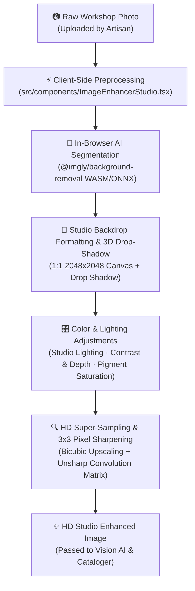

# Feature 1: AI Image Enhancer & Studio

## 📌 Overview

The **AI Craft Studio Enhancer** is a built-in photographic processing pipeline designed specifically to optimize Indian artisan product photos. It eliminates cluttered workshop backgrounds, formats photos to e-commerce studio standards ($1:1$ centered aspect ratio with 3D drop-shadows), auto-balances lighting, contrast, saturation, and sharpens micro-textures using **100% free, zero-API-cost client-side AI models**.

---

## 🛠️ Architecture & System Integration



### Where It Lives in Virasya

Integrated as Step 2 of the Artisan Upload Wizard ([`src/app/dashboard/upload/page.tsx`](file:///c:/Users/DELL/Downloads/GITHUB%20PROJECTS/SIH_virasya/src/app/dashboard/upload/page.tsx)):

```
Artisan Uploads Photo ➔ [Step 2: AI Enhancer Studio] ➔ HD Studio Image ➔ Genkit Vision & Multilingual Cataloger
```

---

## 🔬 Technical Implementation Breakdown

### 1. In-Browser AI Background Removal (`@imgly/background-removal`)

- Uses `@imgly/background-removal` running a WebAssembly (WASM) / ONNX neural network segmentation model directly inside the user's web browser.
- **Zero API Key & Zero Cost**: Operates entirely client-side without sending data to third-party paid services.
- Returns a transparent PNG mask isolating the handicraft item from tools, walls, and workshop clutter.

```ts
import { removeBackground } from '@imgly/background-removal';

const blob = await removeBackground(originalImage, {
  progress: (key, current, total) => {
    console.log(`AI Segmentation ${key}: ${Math.round((current / total) * 100)}%`);
  }
});
```

---

### 2. Studio Lighting & Color Adjustments (Brightness, Contrast, Saturation, Sharpness)

The studio includes 4 photographic color & micro-texture fine-tuning controls:

| Control Slider | Range | Default Preset | Technical Function & Canvas Effect |
| --- | --- | --- | --- |
| 💡 **Studio Lighting (Brightness)** | 80% – 130% | **108%** (+8%) | Balances workshop shadow underexposure via CSS `brightness(108%)` |
| 🌓 **Contrast & Depth** | 80% – 130% | **112%** (+12%) | Enhances shadow/highlight separation via `contrast(112%)` |
| 🎨 **Pigment Saturation** | 80% – 140% | **115%** (+15%) | Saturates natural craft dyes, terracotta, wood grain via `saturate(115%)` |
| 🔍 **Pixel Micro-Sharpness** | 0% – 100% | **35%** | Applies 3x3 unsharp convolution matrix directly on canvas `ImageData` |

```ts
// Combined Canvas filter application
ctx.filter = `brightness(${brightness}%) contrast(${contrast}%) saturate(${saturate}%)`;
```

---

### 3. E-Commerce Studio Backdrops & 3D Drop-Shadow

The isolated craft cutout is drawn onto a $1:1$ square ($2048 \times 2048$ HD) canvas with $12\%$ margins. Artisans can choose from 5 live studio backdrops:

| Studio Backdrop | Description | Render Method |
| --- | --- | --- |
| 🤍 **Studio White** | Standard Amazon/Etsy clean minimal background | `#ffffff` solid canvas fill |
| 🏺 **Warm Heritage** | Soft amber/cream radial studio gradient for Indian crafts | `createRadialGradient('#fffbf5', '#f5ebe0')` |
| 🏢 **Cool Slate** | Modern dark neutral studio backdrop | `createRadialGradient('#f8fafc', '#e2e8f0')` |
| 🏁 **Transparent PNG** | Cutout mode for marketing graphics and social banners | Clear canvas export as `image/png` |
| 📸 **Original Workshop** | Keeps raw workshop background with lighting & HD sharpness applied | Raw image draw |

**3D Directional Drop-Shadow**:
When a studio backdrop is selected, canvas rendering applies a soft directional drop-shadow (`shadowColor: 'rgba(0, 0, 0, 0.15)', shadowBlur: 40, offsetY: 25`) under the craft object so it grounds naturally on the studio backdrop.

---

### 4. HD Super-Sampling & 3x3 Convolution Sharpening

- **HD Super-Sampling**: Lower-resolution mobile photos are upscaled by $1.5\times$ up to $2048\text{px}$ using high-quality bicubic interpolation (`ctx.imageSmoothingQuality = 'high'`).
- **Pixel-Level 3x3 Convolution Sharpening**: Applies a 3x3 Laplacian unsharp mask matrix on the raw pixel buffer (`ImageData`) to enhance micro-textures (pottery glaze reflections, embroidery weaves, wood grain):

$$\begin{bmatrix} 0 & -\alpha & 0 \\ -\alpha & 1 + 4\alpha & -\alpha \\ 0 & -\alpha & 0 \end{bmatrix}$$

---

### 5. 100% Real-Time Live Preview Engine

The component features a live before/after split viewer with a draggable divider (`↔`):
- **Live Color & Lighting Preview**: CSS `brightness()`, `contrast()`, and `saturate()` update live as sliders move.
- **Live SVG Convolve Sharpening**: Uses a hidden SVG `<feConvolveMatrix>` filter (`#live-sharpen-filter`) for 60fps instant sharpness previews as the slider moves.
- **Live Radial Backdrop Rendering**: Instant CSS background gradient updating as backdrop chips are clicked.
- **Auto-Segmentation Trigger**: Selecting any studio backdrop chip automatically triggers AI background removal if not already generated.

---

## 📁 Key File Map

- [`src/components/ImageEnhancerStudio.tsx`](file:///c:/Users/DELL/Downloads/GITHUB%20PROJECTS/SIH_virasya/src/components/ImageEnhancerStudio.tsx) — Main AI Enhancer Studio component
- [`src/app/dashboard/upload/page.tsx`](file:///c:/Users/DELL/Downloads/GITHUB%20PROJECTS/SIH_virasya/src/app/dashboard/upload/page.tsx) — Upload wizard integration
- [`package.json`](file:///c:/Users/DELL/Downloads/GITHUB%20PROJECTS/SIH_virasya/package.json) — Includes `@imgly/background-removal`

---

## 🧪 Verification & Type Safety

- **TypeScript Compiler**: `npm run typecheck` passes cleanly with **0 errors**.
- **ESLint**: `npm run lint` passes cleanly with **0 errors**.
